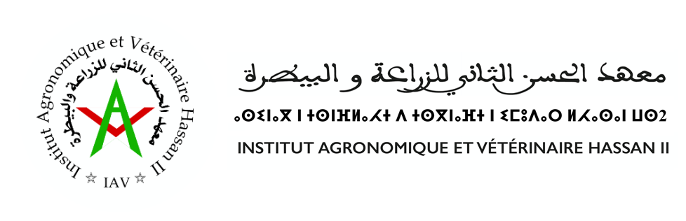
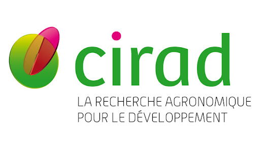

# Thesis : Evaluation of deep learning model performance to predict the chemical composition of forage from near-infrared spectroscopy data.

  
  

This repository contains the code, report, and results for the Final Year Project, in order to obtain my state Agricultural Engineering degree with a specialization in Data Science in Agriculture at the [Hassan II Agronomic and Veterinary Institute](https://iav.ac.ma/), titled: 
"Évaluation des performances de modèles d'apprentissage profond pour prédire la composition chimique de fourrage à partir de données de spectroscopie en proche infrarouge"

The project evaluates and compares the performance of several deep learning architectures against advanced chemometric methods for predicting six key chemical components in forage samples using a private dataset from [CIRAD-Selmet](https://umr-selmet.cirad.fr/).

## Repository Structure

- **/Report** - Contains the final thesis [Report](Report/Rapport_PFE_DSSAM_Abdelali.pdf) and the [presentation](Report/Présentation_soutenance_DSSAM_Abdelali.pptx) used in the defence of the thesis.

- **/python** : Includes the Python code for optimizing the models used, with the  [`requirements.txt`](python/requirements.txt) for the libraries required.

- **/Julia** : Contains the Julia code for the chemometric models (PLS and kNN-LWPLSR) implemented using the [JChemo](https://github.com/mlesnoff/Jchemo.jl) library, as well as the [`Project.toml`](Julia/Project.toml).

- **/results** : Stores the final results, figures, and performance comparisons generated during the study.

## Methodology
The study conducts a comparative analysis between a benchmark local non-linear chemometric model, kNN-LWPLSR, and three distinct Deep Learning strategies:

- [1D-CNN](https://doi.org/10.1016/j.chemolab.2023.105023) : A direct supervised convolutional approach for feature extraction.

- [IPA](https://doi.org/10.1016/j.fuel.2024.133016) : A more complex, multi-scale architecture inspired by the Inception model.

- [1D-CAE](https://doi.org/10.7717/peerj-cs.1266) : An unsupervised feature extraction approach using a 1D Convolutional Autoencoder, followed by a regression.

___
# Author
[DSSAM Abdelali](https://github.com/AliD47)

Under the supervision of :
- [BENSIALI Saloua](https://www.researchgate.net/profile/Saloua-Bensiali)
- [LESNOFF Matthieu](https://github.com/mlesnoff)
